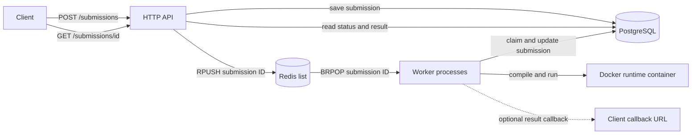

# Juri Architecture

Juri v0 separates the HTTP API from judge workers. PostgreSQL stores
submissions and results; Redis carries submission IDs from the API to workers.

## Request Flow

## Components

- **API:** Validates submissions, saves them in PostgreSQL, and adds their IDs
	to the `submission_queue` Redis list. It returns `202 Accepted` and serves
	status and result requests at `GET /submissions/:id`.
- **Redis:** Holds submission IDs only. The list is shared by all worker
	processes.
- **Worker:** Removes an ID from Redis, changes its PostgreSQL status from
	`queued` to `running`, runs the judge, and saves the final status and result.
	If a callback URL was supplied, it posts the result after saving it.
- **PostgreSQL:** The source of truth for submission input, status, and result.
- **Docker runtime:** Runs untrusted code in a per-submission container. The
	container runs as an unprivileged user, has no network access, uses a
	read-only root filesystem and resource limits, and mounts a temporary
	workspace. The runner compiles once and executes test cases sequentially.

## Scaling and Limits

The API and workers can be run as separate processes and scaled independently.
Multiple worker processes consume from the shared Redis list, with each worker
processing one submission at a time. PostgreSQL's conditional status update
prevents a duplicate queue ID from being processed twice at the same time.

Workers use Redis `BRPOP`, which removes an ID as it is received. A worker
requeues the ID when processing returns an error, but a crash after the pop can
leave a submission marked `queued` in PostgreSQL with no corresponding Redis
entry. The API also writes the database row and queue entry separately. The
current queue therefore does not provide guaranteed delivery or automatic
recovery.

Within a submission, compilation and test cases are sequential. Concurrent
jobs within one worker and a reusable container pool are planned, not current
features.
